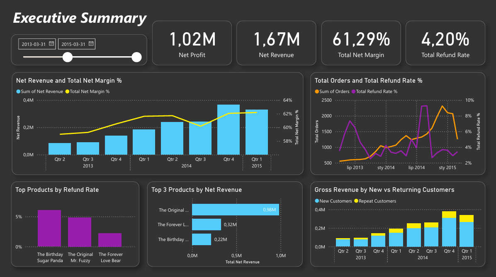
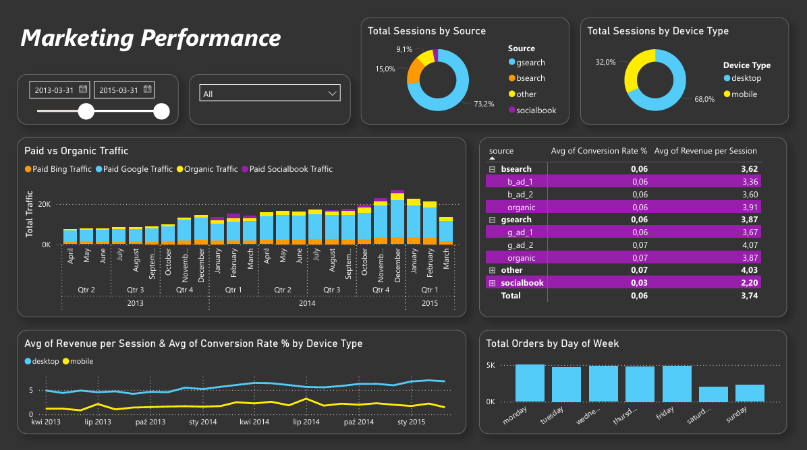
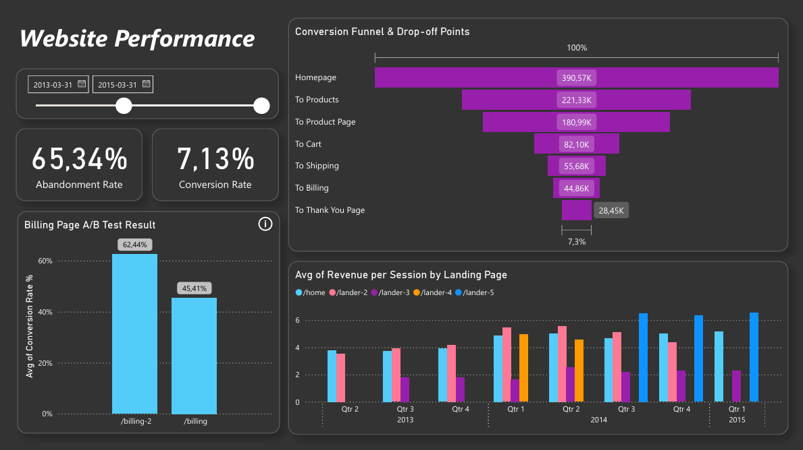

# 🧸 Maven Toys: E-commerce Sales & Conversion Analysis

## 📌 Executive Summary
This project is an end-to-end data analysis simulation for **Maven Toys**, a fictional e-commerce retailer. The objective was to transform raw transaction and web traffic data into actionable business insights to drive revenue growth.

> **Key Achievement:** Validated a checkout optimization opportunity (Billing Page A/B Test) that resulted in a **+36% relative lift in conversion rate**, projecting an estimated **38% increase in monthly revenue** without additional ad spend.

---

## 🏗️ Project Architecture & Tech Stack
This project follows a Data Engineering & Analytics workflow:

* **Database:** MySQL (ETL, Data Warehousing)
* **Visualization:** Power BI (Data Modeling, DAX, Storytelling)
* **Techniques:** Data Cleaning, Window Functions, CTEs, Time-boxed A/B Testing, Funnel Analysis

### The Pipeline
1.  **Extract & Load:** Imported 500k+ raw records (orders, pageviews, sessions) into staging tables.
2.  **Transform (ETL):** Cleaned data, cast types, and indexed foreign keys for query optimization.
3.  **Analyze:** Built SQL Data Marts (`bi_` tables) to serve as a semantic layer.
4.  **Visualize:** Connected Power BI to MySQL for dynamic reporting.

---

## 🔍 Key Insights & Analysis

### 1. Sales Performance & Trends
Analyzed revenue growth, profit margins, and seasonality.

* **Growth:** The company shows a consistent upward trend in Net Revenue, with strong Q4 seasonality.
* **Product Mix:** Identified top-performing products by Net Profit (accounting for refunds and COGS).
* **Customer Loyalty:** Implemented "New vs. Repeat" analysis, showing a growing share of revenue coming from loyal customers.

**Dashboard Preview:**

### 2. Marketing Optimization
Evaluated the ROI of traffic sources and device performance.

* **Desktop vs. Mobile Gap:** Detected a significant disparity in Revenue Per Session (RPS) between Desktop and Mobile users, highlighting a need for mobile UX improvements.
* **Channel Strategy:** While **Google Search** drives the most volume, alternative channels (like **Bing**) show competitive conversion rates, suggesting an opportunity for budget diversification.

**Dashboard Preview:**

### 3. Website Performance & A/B Testing
Performed granular funnel analysis to find bottlenecks and validated design experiments.

#### 📉 Conversion Funnel
Mapped the user journey from `/home` to `/thank-you`.
* **Bottleneck Identified:** The largest drop-off occurred between the Product Page and Cart (only ~45% add to cart) and at the Billing Page.

#### 🧪 A/B Test Results: Billing Page
**Objective:** Validated the performance of the redesigned checkout page (`/billing-2`) against the original version. The primary goal was to improve the Conversion Rate, but I extended the analysis and found out that Revenue Per Session was positively impacted as well.

* *Methodology Note: To ensure data integrity, I restricted the analysis to the Sep 2012 – Jan 2013 timeframe where both pages were active concurrently.*

**Key Findings:**
* **Conversion Rate (Primary KPI):** The new version achieved a **62.44%** conversion rate vs. **45.41%** for the original (**+17 p.p. lift**).
* **Revenue Efficiency:** The analysis confirmed that the higher conversion volume directly translated into value—**Revenue Per Session increased by $8.72**.

**Conclusion:**
The test proved that the redesign was a highly effective decision, successfully removing friction from the checkout process and driving higher profitability per user.

**Dashboard Preview:**

---

## 📂 Repository Structure
The project is organized as follows:

| File / Folder | Description |
| :--- | :--- |
| `00_data_loading.ipynb` | **Python (Pandas/SQLAlchemy)** script to automate raw data ingestion into MySQL. |
| `01_etl_pipeline.sql` | Schema creation, data cleaning, and indexing strategy. |
| `02_sales_analysis.sql` | Advanced SQL queries for financial trends and customer retention. |
| `03_marketing_analysis.sql` | Evaluation of traffic sources and marketing efficiency. |
| `04_website_performance.sql` | Complex funnel analysis and A/B test validation. |
| `Maven_Toys_Report.pbix` | The interactive Power BI dashboard file. |

---

## 🚀 Strategic Recommendations

* **Checkout Optimization:** Fully transition to the `/billing-2` layout. Data proves this change drives significantly higher unit economics (**+$8.72/session**) compared to the legacy version.
* **Capitalize on Weekday Momentum:** Sales volume is consistently higher on weekdays compared to weekends. Marketing campaigns and email blasts should be scheduled Monday–Friday to align with peak customer purchasing intent.
* **Expand Bing Ads Presence:** While Google drives volume, Bing demonstrates an impressive Click-Through Rate (CTR) and efficiency. There is an untapped opportunity to scale the budget for Bing to capture high-intent users at a potentially lower CPA.
* **Mobile Experience:** Prioritize mobile interface improvements. The gap between high traffic volume and low conversion indicates substantial untapped revenue potential.
* **Course Correction - Landing Pages:** Analysis detects that one of the top-performing pages, `/lander-2` (with High Revenue Per Session), was deprecated in Q1 2015 in favor of the inferior `/lander-3`. **Reinstating `/lander-2` is recommended** to recover lost revenue efficiency.

---

### 👩‍💻 Author: **Karolina Marek**
